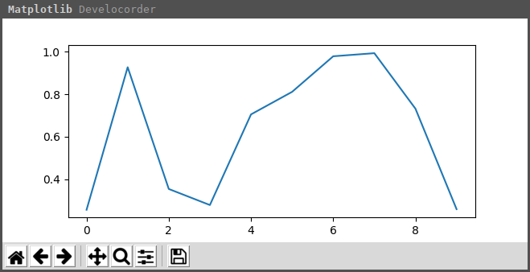
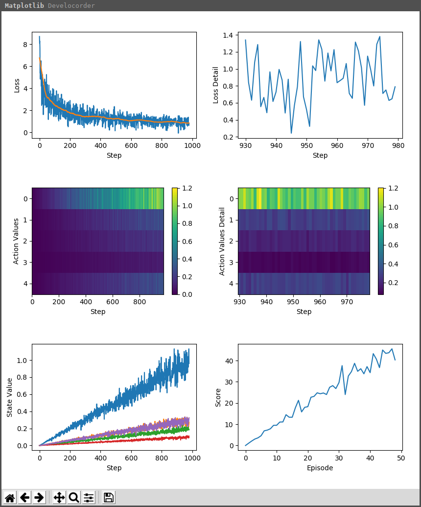

Develocorder
============


Develocorder is a simple live value plotter for Python3 using Matplotlib. It is intended to give insights into the training of machine learning models / reinforcement learning agents with only minimal effort to add to existing code.


[(image source)](https://commons.wikimedia.org/wiki/File:Viewing_of_Develocorder_Film.jpg)


Installation
------------

```
$ pip install develocorder
```


Simple Example
--------------

``` python
# initialize once
set_recorder(my_value=LinePlot())

# add values to plot from anywhere in code
for _ in range(10):
    record(my_value=random())
```
See [examples/simple.py](examples/simple.py)

### Result



Fancy Example
--------------

Some more features:

``` python
# axis labels
set_recorder(labeled=LinePlot(xlabel="Episode", ylabel="Score"))

# additional filtered values (window filter)
set_recorder(filtered=FilteredLinePlot(filter_size=50))

# maximum history length
set_recorder(detail=LinePlot(max_length=50))

# downsampled values (record mean of every filter_size values)
set_recorder(downsampled=DownsampledLinePlot(filter_size=5))

# multiple curves for recording 1d-array values
set_recorder(multiple=FilteredLinePlot(filter_size=50))

# heatmap for recording 1d-array values
set_recorder(heatmap=Heatmap())

# minimum update period (limit update rate for better performance)
set_update_period(0.5)  # [seconds]

# set number of columns
set_num_columns(2)
```
See [examples/fancy.py](examples/fancy.py)




Jupyter notebook
----------------

For use in a Jupyter notebook use the `%matplotlib notebook` backend. As of now you cannot rerun the cell which is showing the plot without restarting the notebook, otherwise the plot will disappear.

See [examples/simple.ipynb](examples/simple.ipynb)


TODOs
-----
  - [ ] document how to extend
  - [ ] better support for jupyter notebook
  - [ ] add new plot types
  - [ ] persistent storage/loading of log
